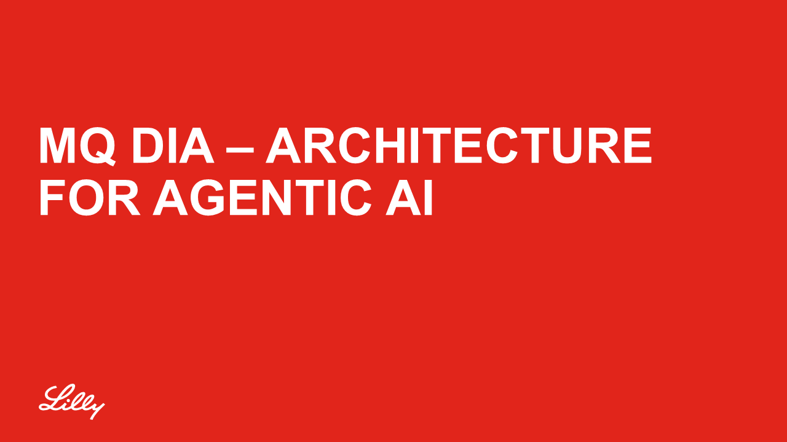
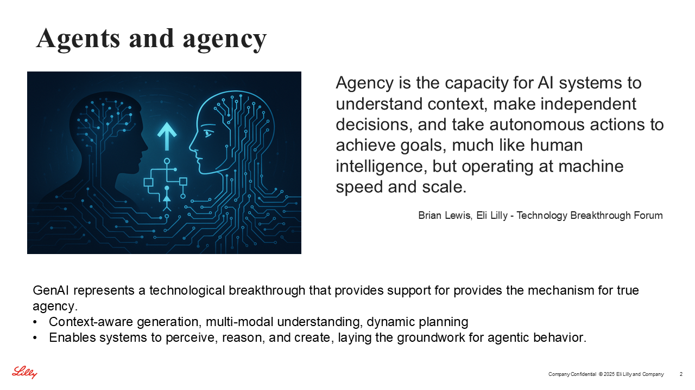
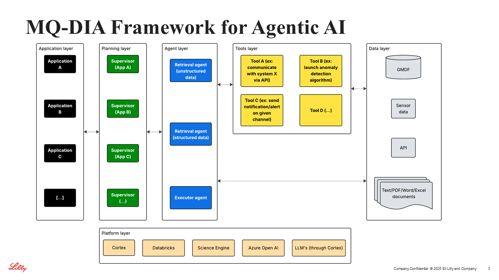
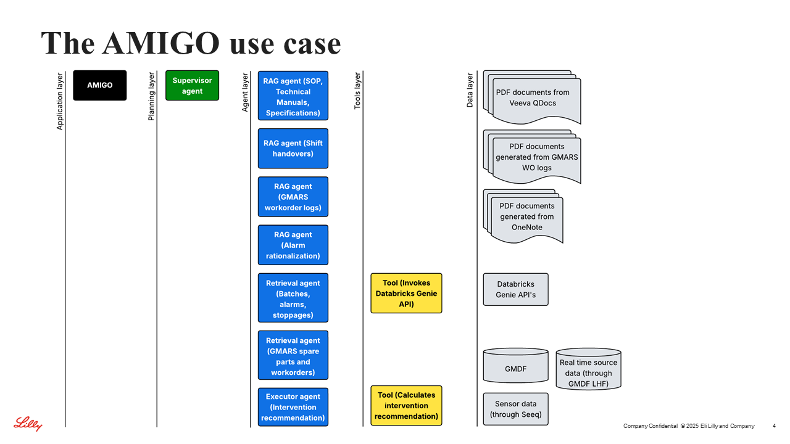
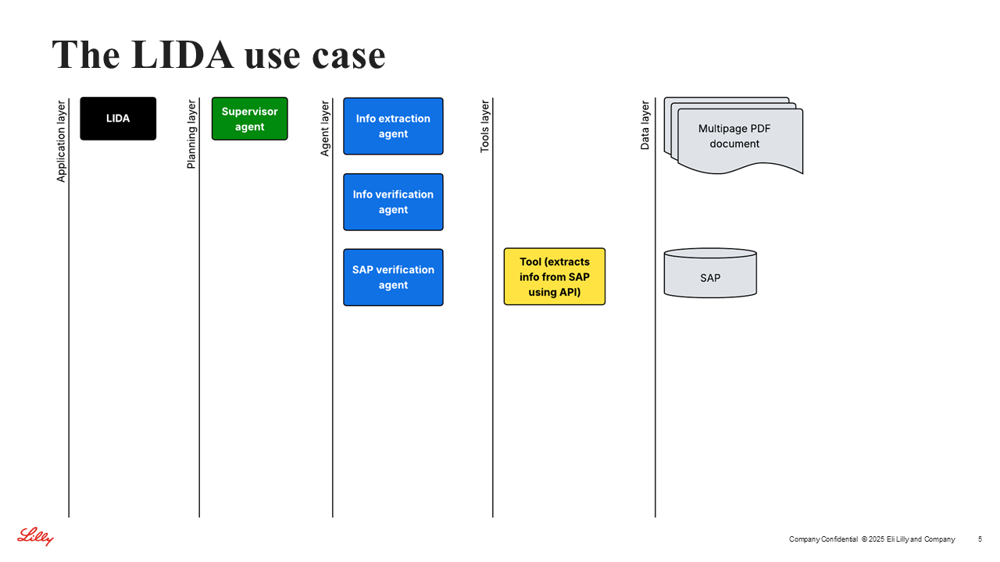

# 2025 11   MQ DIA Agentic architecture (1)

## Slide 1

📄 Text content (for search)

MQ DIA – Architecture for agentic AI

## Slide 2

📄 Text content (for search)

Agents and agency
Company Confidential  © 2025 Eli Lilly and Company
Agency is the capacity for AI systems to understand context, make independent decisions, and take autonomous actions to achieve goals, much like human intelligence, but operating at machine speed and scale.
Brian Lewis, Eli Lilly - Technology Breakthrough Forum
GenAI represents a technological breakthrough that provides support for provides the mechanism for true agency.
Context-aware generation, multi-modal understanding, dynamic planning
Enables systems to perceive, reason, and create, laying the groundwork for agentic behavior.

## Slide 3

📄 Text content (for search)

MQ-DIA Framework for Agentic AI
Company Confidential  © 2025 Eli Lilly and Company

## Slide 4

📄 Text content (for search)

The AMIGO use case
Company Confidential  © 2025 Eli Lilly and Company

## Slide 5

📄 Text content (for search)

The LIDA use case
Company Confidential  © 2025 Eli Lilly and Company

