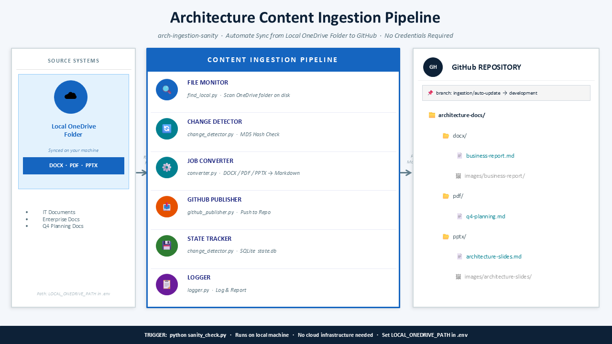
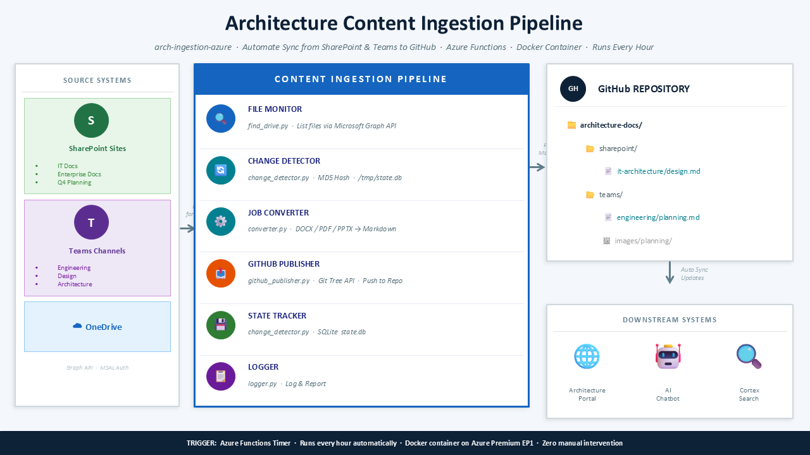
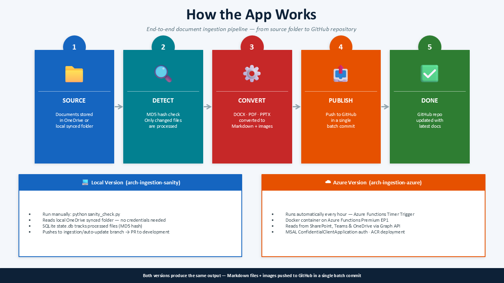

# Project Architecture v3

## Slide 1

📄 Text content (for search)

Architecture Content Ingestion Pipeline
arch-ingestion-sanity  ·  Automate Sync from Local OneDrive Folder to GitHub  ·  No Credentials Required
SOURCE SYSTEMS
☁
Local OneDrive
Folder
Synced on your machine
DOCX  ·  PDF  ·  PPTX
IT Documents
Enterprise Docs
Q4 Planning Docs
Path: LOCAL_ONEDRIVE_PATH in .env
Reads
Files
CONTENT INGESTION PIPELINE
🔍
FILE MONITOR
find_local.py  ·  Scan OneDrive folder on disk
🔄
CHANGE DETECTOR
change_detector.py  ·  MD5 Hash Check
⚙️
JOB CONVERTER
converter.py  ·  DOCX / PDF / PPTX → Markdown
📤
GITHUB PUBLISHER
github_publisher.py  ·  Push to Repo
💾
STATE TRACKER
change_detector.py  ·  SQLite  state.db
📋
LOGGER
logger.py  ·  Log & Report
Publish
Markdown
GH
GitHub REPOSITORY
📌  branch: ingestion/auto-update  →  development
📁  architecture-docs/
📂  docx/
📄  business-report.md
🖼  images/business-report/
📂  pdf/
📄  q4-planning.md
📂  pptx/
📄  architecture-slides.md
🖼  images/architecture-slides/
TRIGGER:  python sanity_check.py   ·   Runs on local machine   ·   No cloud infrastructure needed   ·   Set LOCAL_ONEDRIVE_PATH in .env

## Slide 2

📄 Text content (for search)

Architecture Content Ingestion Pipeline
arch-ingestion-azure  ·  Automate Sync from SharePoint & Teams to GitHub  ·  Azure Functions  ·  Docker Container  ·  Runs Every Hour
SOURCE SYSTEMS
S
SharePoint Sites
IT Docs
Enterprise Docs
Q4 Planning
T
Teams Channels
Engineering
Design
Architecture
☁  OneDrive
Graph API  ·  MSAL Auth
Polling
for Changes
CONTENT INGESTION PIPELINE
🔍
FILE MONITOR
find_drive.py  ·  List files via Microsoft Graph API
🔄
CHANGE DETECTOR
change_detector.py  ·  MD5 Hash  ·  /tmp/state.db
⚙️
JOB CONVERTER
converter.py  ·  DOCX / PDF / PPTX → Markdown
📤
GITHUB PUBLISHER
github_publisher.py  ·  Git Tree API  ·  Push to Repo
💾
STATE TRACKER
change_detector.py  ·  SQLite  state.db
📋
LOGGER
logger.py  ·  Log & Report
Publish
Markdown
GH
GitHub REPOSITORY
📁  architecture-docs/
📂  sharepoint/
📄  it-architecture/design.md
📂  teams/
📄  engineering/planning.md
🖼  images/planning/
Auto Sync
Updates
DOWNSTREAM SYSTEMS
🌐
Architecture
Portal
🤖
AI
Chatbot
🔍
Cortex
Search
TRIGGER:  Azure Functions Timer  ·  Runs every hour automatically  ·  Docker container on Azure Premium EP1  ·  Zero manual intervention

## Slide 3

📄 Text content (for search)

How the App Works
End-to-end document ingestion pipeline — from source folder to GitHub repository
1
📁
SOURCE
Documents stored
in OneDrive or
local synced folder
2
🔍
DETECT
MD5 hash check
Only changed files
are processed
3
⚙️
CONVERT
DOCX · PDF · PPTX
converted to
Markdown + images
4
📤
PUBLISH
Push to GitHub
in a single
batch commit
5
✅
DONE
GitHub repo
updated with
latest docs
💻  Local Version  (arch-ingestion-sanity)
Run manually: python sanity_check.py
Reads local OneDrive synced folder — no credentials needed
SQLite state.db tracks processed files (MD5 hash)
Pushes to ingestion/auto-update branch → PR to development
☁  Azure Version  (arch-ingestion-azure)
Runs automatically every hour — Azure Functions Timer Trigger
Docker container on Azure Functions Premium EP1
Reads from SharePoint, Teams & OneDrive via Graph API
MSAL ConfidentialClientApplication auth · ACR deployment
Both versions produce the same output — Markdown files + images pushed to GitHub in a single batch commit

